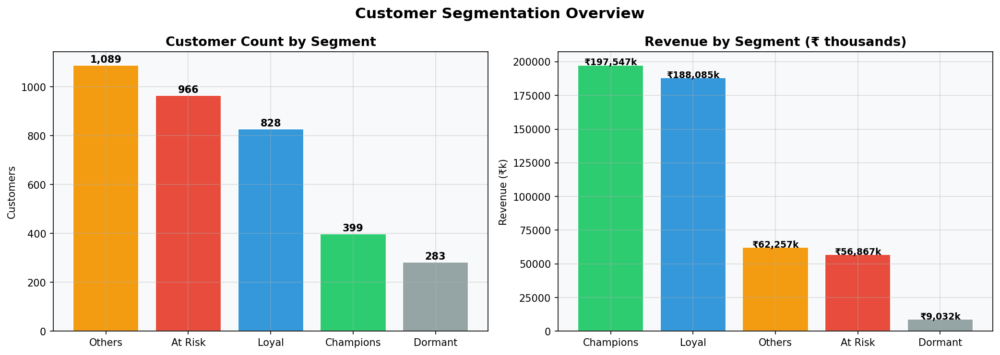
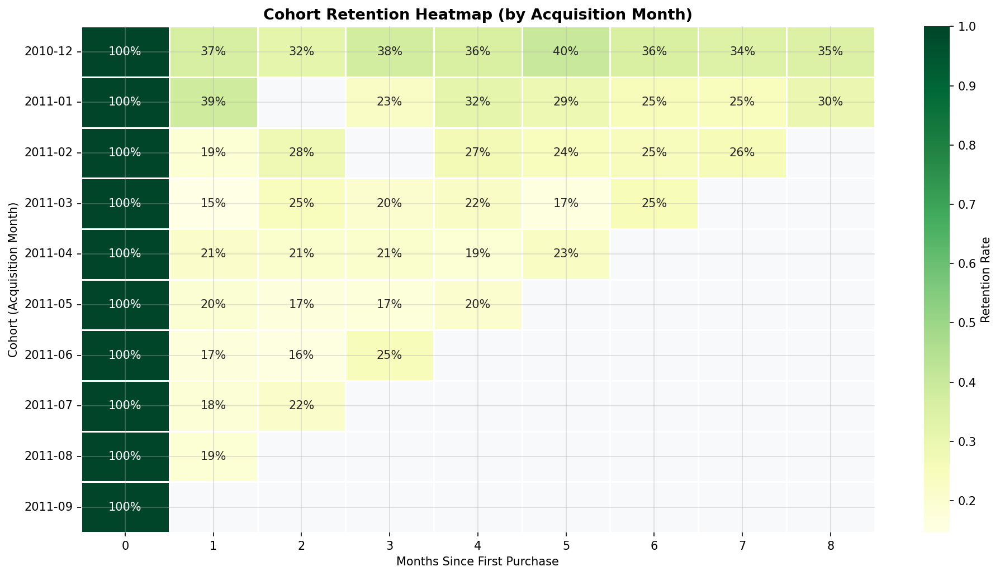
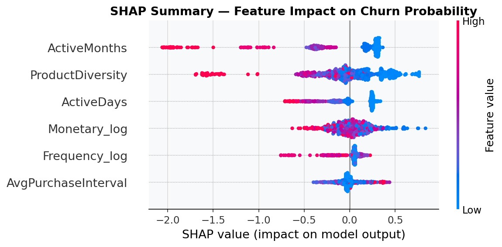
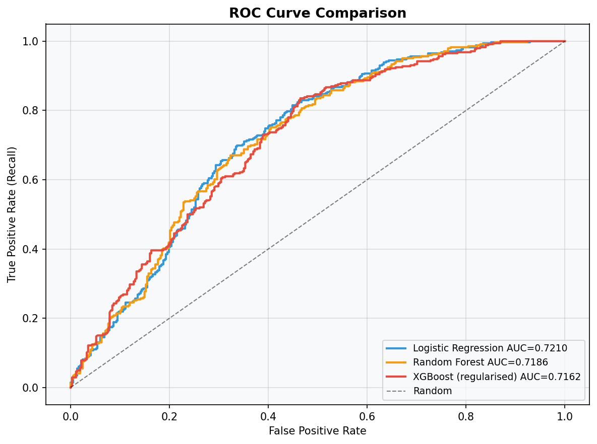

# Retail Customer Churn Prediction & CLV-Based Segmentation

Acquiring a new customer costs **5–7× more** than retaining one.
This project predicts which customers will churn, segments them by
business value, and delivers actionable retention recommendations —
built as a production-ready ML pipeline with an interactive dashboard.


---

## Business Problem

Most businesses react to churn after it happens. This project solves
it proactively by answering three questions:

- **Who** is likely to leave? → XGBoost churn probability per customer
- **How much does it cost?** → Expected Revenue Loss = Σ(CLV × Churn Probability)
- **What do we do about it?** → Priority group + recommended action per customer

---

## Key Results

| Metric | Value |
|--------|-------|
| Dataset | 541,909 transactions → 3,565 customer profiles |
| Churn Rate | 48.6% |
| XGBoost CV AUC | 0.7287 ± 0.0149 (5-fold) |
| XGBoost Test AUC | 0.7164 |
| Top Churn Predictor | ActiveMonths (SHAP = 0.479) |
| Priority Groups | 4 (High Priority, Loyalty, Nurture, Low Priority) |

---

## Customer Segmentation

> RFM scoring identifies which customers drive revenue and which are at risk.



---

## Cohort Retention Analysis

> Shows what percentage of customers from each acquisition month are still buying in later months.



---

## Model Explainability — SHAP

> ActiveMonths is the strongest churn predictor — customers active across fewer months
> are consistently pushed toward higher churn probability.



---

## Model Performance

> ROC curve comparison across all three models. XGBoost selected as production model.



---

## ML Pipeline — 17 Steps

| Step | What Happens |
|------|-------------|
| 1 | Load 541,909 raw transactions |
| 2 | Clean data — remove cancellations, nulls, outliers |
| 3 | Split into observation window (features) and future window (churn label) |
| 4 | Engineer RFM + 6 behavioral features per customer |
| 5 | Create churn label — absent in future window = churned |
| 6 | RFM scoring 1–5 + rule-based segmentation |
| 7 | Mutual information feature selection — 6 features selected |
| 8 | Stratified temporal train/test split — prevents data leakage |
| 9 | Train Logistic Regression, Random Forest, XGBoost |
| 10 | Evaluate — ROC-AUC, F1, Precision, Recall, overfitting diagnosis |
| 11 | SHAP explainability — feature importance per customer |
| 12 | Retrain final model on full dataset |
| 13 | Score all 3,565 customers with churn probability |
| 14 | Compute CLV + Expected Revenue Loss per customer |
| 15 | Assign priority group + retention action |
| 16 | Generate all business charts and dashboards |
| 17 | Save all outputs — CSVs, JSONs, PNGs, model files |

---

## Tech Stack

| Category | Tools |
|----------|-------|
| Language | Python |
| ML Models | XGBoost, Random Forest, Logistic Regression |
| Explainability | SHAP |
| Data Processing | Pandas, NumPy |
| Visualisation | Plotly, Matplotlib, Seaborn |
| Dashboard | Streamlit |
| Model Persistence | Joblib |

---

## Project Structure

```
retail_churn/
├── pipelines/
│   └── run_pipeline.py         # Run this first — executes all 17 steps
├── app.py                      # Run this second — launches dashboard
├── src/
│   ├── config.py               # All constants and hyperparameters
│   ├── data_loader.py
│   ├── preprocessing.py
│   ├── feature_engineering.py
│   ├── segmentation.py
│   ├── train.py
│   ├── evaluation.py
│   ├── explainability.py
│   ├── predict.py
│   ├── business_metrics.py
│   └── visualization.py
├── dashboard/
│   ├── pages/
│   │   ├── executive_overview.py
│   │   ├── customer_segmentation.py
│   │   ├── predictive_intelligence.py
│   │   └── retention_strategy.py
│   └── styles/
│       └── custom.css
└── outputs/
    ├── plots/
    ├── predictions/
    └── metrics/
```

---

## Setup

```bash
# 1. Install dependencies
pip install -r requirements.txt

# 2. Add dataset
#    Download: https://archive.ics.uci.edu/ml/datasets/Online+Retail
#    Place at: data/OnlineRetail.csv

# 3. Run the ML pipeline
python pipelines/run_pipeline.py

# 4. Launch the dashboard
streamlit run app.py
```

> **Windows users:** If SHAP installation fails, run `python install.py` instead of step 1.

---

*Dataset: UCI Machine Learning Repository — Online Retail*
