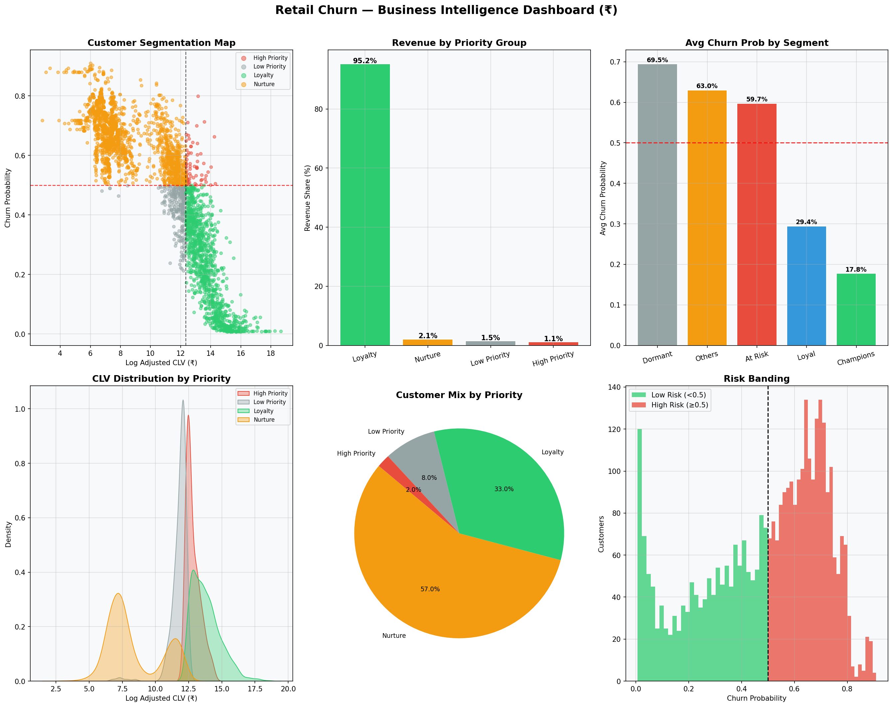
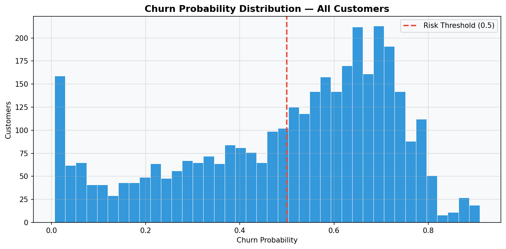

# Retail Customer Churn Prediction & CLV-Based Segmentation

> Acquiring a new customer costs **5–7× more** than retaining one.
> This project predicts which customers will churn, segments them by
> business value, and delivers actionable retention recommendations —
> built as a production-ready ML pipeline with an interactive dashboard.


---

## Business Problem

Most businesses react to churn after it happens. This project solves
it proactively by answering three questions:

- **Who** is likely to leave? → XGBoost churn probability per customer
- **How much does it cost?** → Expected Revenue Loss = Σ(CLV × Churn Probability)
- **What do we do about it?** → Priority group + recommended action per customer

---

## Key Results

| Metric | Value |
|--------|-------|
| Dataset | 541,909 transactions → 3,565 customer profiles |
| Churn Rate | 48.6% |
| XGBoost CV AUC | 0.7287 ± 0.0149 (5-fold) |
| XGBoost Test AUC | 0.7164 |
| Top Churn Predictor | ActiveMonths (SHAP = 0.479) |
| Priority Groups | 4 (High Priority, Loyalty, Nurture, Low Priority) |

---

## Dashboard Preview

### Executive Overview — KPIs & Segment Analysis


### Customer Segmentation — CLV & Priority Groups


### Predictive Intelligence — Model Performance & SHAP


### Retention Strategy — Campaign Simulator


---

## ML Pipeline — 17 Steps

| Step | What Happens |
|------|-------------|
| 1 | Load 541,909 raw transactions |
| 2 | Clean data — remove cancellations, nulls, outliers |
| 3 | Split into observation window (features) and future window (churn label) |
| 4 | Engineer RFM + 6 behavioral features per customer |
| 5 | Create churn label — absent in future window = churned |
| 6 | RFM scoring 1–5 + rule-based segmentation |
| 7 | Mutual information feature selection — 6 features selected |
| 8 | Stratified temporal train/test split — prevents data leakage |
| 9 | Train Logistic Regression, Random Forest, XGBoost |
| 10 | Evaluate — ROC-AUC, F1, Precision, Recall, overfitting diagnosis |
| 11 | SHAP explainability — feature importance per customer |
| 12 | Retrain final model on full dataset |
| 13 | Score all 3,565 customers with churn probability |
| 14 | Compute CLV + Expected Revenue Loss per customer |
| 15 | Assign priority group + retention action |
| 16 | Generate all business charts and dashboards |
| 17 | Save all outputs — CSVs, JSONs, PNGs, model files |

---

## Tech Stack

| Category | Tools |
|----------|-------|
| Language | Python |
| ML Models | XGBoost, Random Forest, Logistic Regression |
| Explainability | SHAP |
| Data Processing | Pandas, NumPy |
| Visualisation | Plotly, Matplotlib, Seaborn |
| Dashboard | Streamlit |
| Model Persistence | Joblib |

---

## Project Structure

```
retail_churn/
├── pipelines/
│   └── run_pipeline.py         # Run this first — executes all 17 steps
├── app.py                      # Run this second — launches dashboard
├── src/
│   ├── config.py               # All constants and hyperparameters
│   ├── data_loader.py          # Step 1  — load raw CSV
│   ├── preprocessing.py        # Steps 2-3 — clean + time windows
│   ├── feature_engineering.py  # Step 4  — RFM + behavioral features
│   ├── segmentation.py         # Steps 5,15 — segments + CLV priority
│   ├── train.py                # Steps 7-9  — feature selection + models
│   ├── evaluation.py           # Steps 10-12 — metrics + threshold
│   ├── explainability.py       # Step 11 — SHAP
│   ├── predict.py              # Step 13 — score all customers
│   ├── business_metrics.py     # Steps 16-17 — KPIs + validation
│   └── visualization.py        # All chart generation
├── dashboard/
│   ├── pages/
│   │   ├── executive_overview.py
│   │   ├── customer_segmentation.py
│   │   ├── predictive_intelligence.py
│   │   └── retention_strategy.py
│   ├── components/
│   │   ├── charts.py
│   │   ├── kpi_cards.py
│   │   ├── sidebar.py
│   │   └── tables.py
│   └── styles/
│       └── custom.css
└── outputs/
    ├── plots/                  # All generated charts (.png)
    ├── predictions/            # Customer prediction CSVs
    └── metrics/                # Model metrics JSON files
```

---

## Setup

```bash
# 1. Install dependencies
pip install -r requirements.txt

# 2. Add dataset
#    Download: https://archive.ics.uci.edu/ml/datasets/Online+Retail
#    Place at: data/OnlineRetail.csv

# 3. Run the ML pipeline
python pipelines/run_pipeline.py

# 4. Launch the dashboard
streamlit run app.py
```

> **Windows users:** If SHAP installation fails, run `python install.py`
> instead of step 1. It handles the C++ build issue automatically.

---

## XGBoost Regularisation

```python
max_depth        = 3    # shallow trees — primary regularisation
min_child_weight = 5    # minimum 5 samples per leaf
subsample        = 0.8  # row subsampling per tree
colsample_bytree = 0.8  # feature subsampling per tree
reg_alpha        = 0.1  # L1 regularisation
reg_lambda       = 1.0  # L2 regularisation
gamma            = 0.1  # minimum gain required to split
```

---

## Dashboard Pages

| Page | What It Shows |
|------|--------------|
| **Home** | Project overview, workflow, setup guide |
| **Executive Overview** | KPIs, churn by segment, monthly trend |
| **Customer Segmentation** | CLV distribution, cohort heatmap, customer table with retention recommendations |
| **Predictive Intelligence** | ROC curve, confusion matrix, SHAP explainability, threshold analysis |
| **Retention Strategy** | Priority groups, campaign simulator with net profit estimate |

---

*Dataset: UCI Machine Learning Repository — Online Retail*
